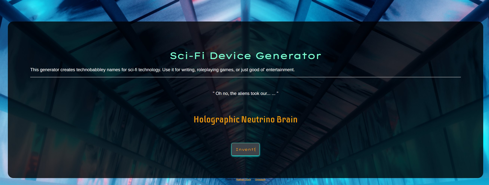

# Sci-Fi Device Generator



## Description

Generate names for sci-fi devices using a technobabble, soft-science style.

## Table of Contents

- [Installation](#installation)
- [Usage](#usage)
- [License](#license)

## Installation

The easiest way to install Sci-Fi-Device Generator is to clone this repository using
the following command.

```
git@github.com:bear-evans/sci-fi-device-generator.git
```

Once downloaded, you can install its dependencies by navigating to the
application's directory and issuing the following command.

```
npm install
```

This will install `express`, `typescript`, and associated types.

## Usage

To initiate the application, run

```
npm run start
```

from the app's directory.

This will build the typescript files into the dist folder, as well as copy static resources such as CSS and HTML to the dist/public folder.

## License

Copyright 2022 Bear Evans

Permission is hereby granted, free of charge, to any person obtaining a copy of
this software and associated documentation files (the "Software"), to deal in
the Software without restriction, including without limitation the rights to
use, copy, modify, merge, publish, distribute, sublicense, and/or sell copies of
the Software, and to permit persons to whom the Software is furnished to do so,
subject to the following conditions:

The above copyright notice and this permission notice shall be included in all
copies or substantial portions of the Software.

THE SOFTWARE IS PROVIDED "AS IS", WITHOUT WARRANTY OF ANY KIND, EXPRESS OR
IMPLIED, INCLUDING BUT NOT LIMITED TO THE WARRANTIES OF MERCHANTABILITY, FITNESS
FOR A PARTICULAR PURPOSE AND NONINFRINGEMENT. IN NO EVENT SHALL THE AUTHORS OR
COPYRIGHT HOLDERS BE LIABLE FOR ANY CLAIM, DAMAGES OR OTHER LIABILITY, WHETHER
IN AN ACTION OF CONTRACT, TORT OR OTHERWISE, ARISING FROM, OUT OF OR IN
CONNECTION WITH THE SOFTWARE OR THE USE OR OTHER DEALINGS IN THE SOFTWARE.
